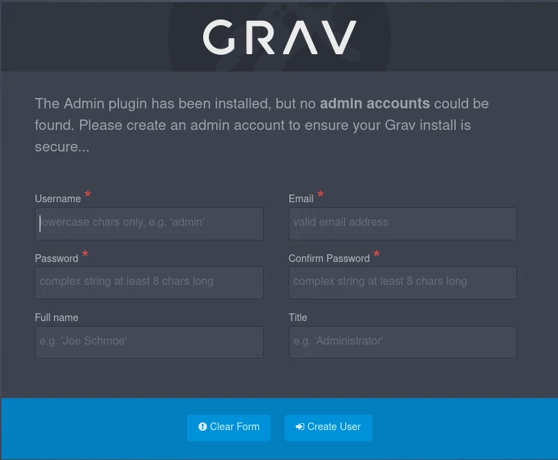
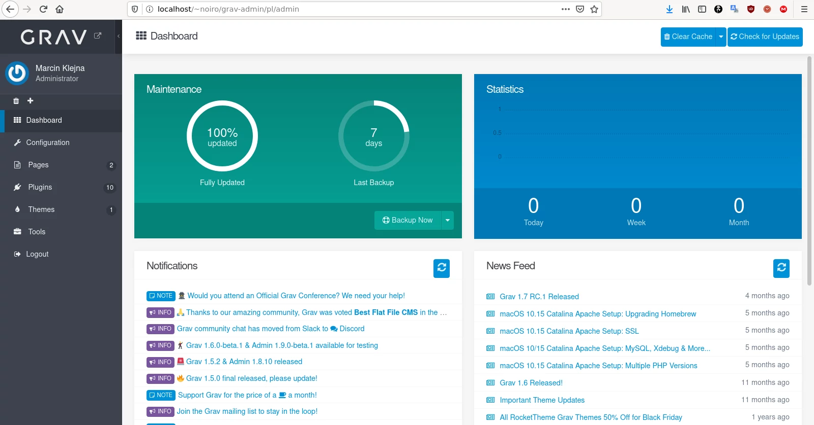

Aby zainstalować `Grav core + Admin plugin` w katalogu domowym w `public_html` musimy spełnić kilka warunków.

W pierwszej kolejności instalujemy serwer `Apache` i `libapache2-mod-php`
```
aptitude install apache2 libapache2-mod-php
```
włączamy moduły `userdir` i `rewrite`
```
a2enmod userdir rewrite
```
i restartujemy serwer:
```
systemctl restart apache2
```
Ponieważ Apache w Debianie domyślnie ma wyłączoną obsługę skryptów PHP w katalogach użytkowników, musimy zredagować plik `/etc/apache2/mods-enabled/php7.3.conf`
znajdujemy sekcje:
```
<IfModule mod_userdir.c>
    <Directory /home/*/public_html>
        php_admin_flag engine Off
    </Directory>
</IfModule>
```
i komentujemy ją:
```
#<IfModule mod_userdir.c>
#    <Directory /home/*/public_html>
#        php_admin_flag engine Off
#    </Directory>
#</IfModule>
```
Jeżeli zamiast tego włączysz `php_admin_flag engine On` stracisz możliwość wyłączenia jej w plikach `.htaccess`

Aby Apache mógł odczytać plik `.htaccess` i zastosować reguły przepisania edytujemy plik `/etc/apache2/apache2.conf` i dodajemy:
```
<Directory /home/*/public_html/>
    Options Indexes FollowSymLinks
    AllowOverride All
    Require all granted
</Directory>
```
Jeżeli instalujemy Grav w `/var/www/` wystarczy zmienić `AllowOverride` z `None` na `All`
```
<Directory /var/www/>
        Options Indexes FollowSymLinks
        AllowOverride All
        Require all granted
</Directory>
```

Grav wymaga następujących modułów PHP:
```
aptitude install php-mbstring php-curl php-zip php-gd php-xml
```
następnie restartujemy serwer:
```
systemctl restart apache2
```
Ściągamy paczkę ze strony https://getgrav.org/downloads i rozpakowujemy w folderze `public_html` w katalogu domowym, nadajemy odpowiednie uprawnienia do zapisu.

Wchodzimy na adres `localhost/~user/grav-admin` i voilà.



Po utworzeniu konta administratora:



