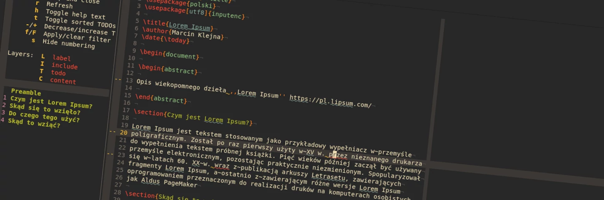
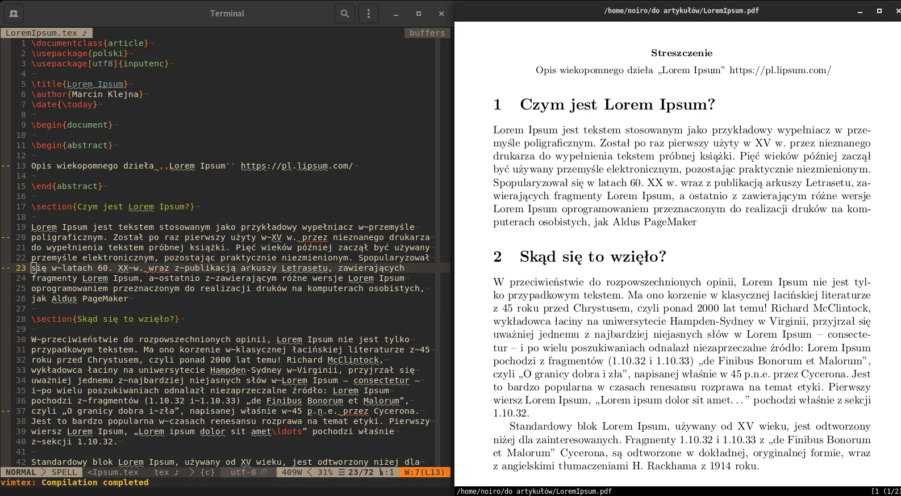
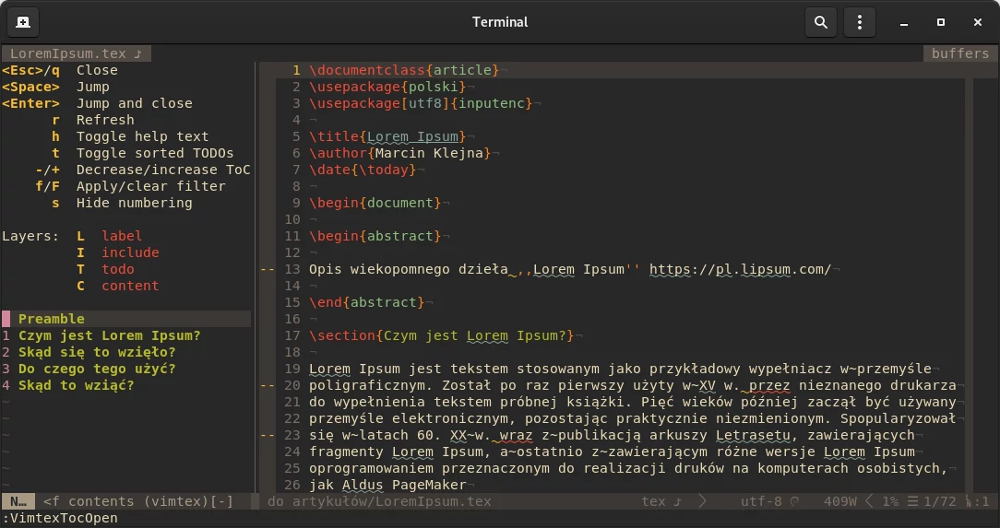

## Parę słów wstępu

Dostosowanie Neovim do pisania w $\LaTeX$ nie jest trudne, ale gdy robi się to
pierwszy raz może zająć trochę czasu. W tym artykule pokaże jak przy pomocy
kilku dodatków zrobić pełnoprawne IDE z podglądem na żywo czy podpowiedziami,
a jako bonus nasze prace będzie pilnował `git`. Nie przejmuj się jeżeli nie
miałeś styczności z vimem postaram się wytłumaczyć wszystko w miarę
łopatologicznie.

Nie skupimy się tutaj na używaniu Neovim jako takiego (zapraszam do innego
artykuł [Wrowadzenie do vima](link)) ale na jego potężnej konfiguralności
i użycia go do pracy z dystrybucją $\TeX$.

Jest do wyboru parę naprawdę fajnych wtyczek ułatwiających pracę z plikami
`.tex` są to między innymi: [LaTeX-Suite](http://vim-latex.sourceforge.net/),
[LaTeX-Box](https://github.com/LaTeX-Box-Team/LaTeX-Box) czy
[quicktex](https://vimawesome.com/plugin/quicktex)... ja wybrałem
[vimtex](https://github.com/lervag/vimtex). Na co dzień używam
[Debiana](https://www.debian.org) więc opis instalacji pakietów będą dotyczyły
tego właśnie OSa.



### (Wymagane) pakiety

 * [TexLive](https://www.tug.org/texlive/)
 * [deoplete](https://github.com/Shougo/deoplete.nvim)
 * [git](https://git-scm.com/)
 * [vimtex](https://github.com/lervag/vimtex)
 * [ale](dense-analysis/ale)
 * [Zathura](https://pwmt.org/projects/zathura/)

## Instalujemy potrzebne komponenty

### Instalujemy $\TeX$ Live

Zaczniemy od instalacji $\TeX$ Live[^TeXlive], to dość rozbudowana dystrybucja
z mnóstwem pakietów, możemy zainstalować całość:

```
# apt-get install texlive-full
```

albo dostosować instalacje pod swoje potrzeby, pamiętajmy jednak aby
zainstalować również pakiet `texlive-lang-polish` aby mieć pełne wsparcie
języka polskiego, polecam zainstalowanie małego programu `texdoctk` do
wygodnego przeglądania dokumentacji zainstalowanej na komputerze.

### Przeglądarka PDF

Instalujemy przeglądarkę wspierającą wyszukiwanie do przodu (_forward search_),
na linuxie mamy spory wybór ja wybrałem
[Zathura](https://pwmt.org/projects/zathura/)

Dlaczego wybrałem zathure?
Przede wszystkim `zathura` ma takie same skróty klawiszowe jak `vim` np.
poruszamy się po dokumencie za pomocą standardowych klawiszy vima `hjkl`

_Forward search:_ Redagując plik `tex` wciskamy `\lv` i nasz otwarty dokument
PDF przeskoczy do miejsca w którym znajduje się kursor.

_Backward search:_ Działa to oczywiście też w drugą stronę będąc na pliku PDF
wciskamy `<C-Enter>` lub `<Ctrl-LeftMouseClick>` i zostajemy przeniesieni do
edytora z kursorem w odpowiednim miejscu.

Więc instalujemy:

```
# apt-get install zathura zathura-pdf-poppler zathura-ps
```



### System kontroli wersji `git`

[Git](https://git-scm.com/) został zaprojektowany w celu zarządzania historią
kodu źródłowego. Ale wcale nie musimy być programistami aby z niego korzystać,
ba to świetne narzędzie pod kontrole którego możemy oddać swoje pliki `tex`.
W tym artykule skupimy się na podstawach podstaw aby zanadto nie komplikować,
ale byśmy mogli swobodnie go używać.

```
# apt-get install git
```

Szybka podstawowa konfiguracja:

```
$ git config --global user.name "Imię Nazwisko"
$ git config --global user.email adres@email.com
$ git config --global core.editor vim
```

Na tym etapie to wszystko co musisz wiedzieć o gicie, w następnej części
artykułu rozwiniemy temat.

### Instalujemy Neovim

Aby zainstalować Neovim, a jakże wykonujemy magiczną komendę:

```
# apt-get install neovim
```
I to wszystko!

## Konfiguracjia Neovim


### Instalacja pluginów

Wtyczki możemy instalować na dwa sposoby przy użyciu któregoś menadżera
pluginów lub przez ręczne pobranie źródeł i rozpakowaniu w katalogu
`.config/nvim/plugged`, ponieważ będziemy używać gita do wersjonowania naszych
dokumentów i że jest to sposób dużo wygodniejszy do zarządzania
i aktualizowania pluginów my użyjemy gita, a raczej użyje go menadżera wtyczek.

Mój wybór to `vim-plug`[^vim-plug] więc instalujemy (musisz mieć zainstalowany
pakiet `curl`):

```shell script
sh -c 'curl -fLo "${XDG_DATA_HOME:-$HOME/.local/share}"/nvim/site/autoload/plug.vim --create-dirs \
  https://raw.githubusercontent.com/junegunn/vim-plug/master/plug.vim'
```

Otwieramy plik `.config/nvim/init.vim` (jeżeli nie ma, to tworzymy odpowiednie
katalogi i pliki)

```
$ mkdir .config/nvim/
$ touch .config/nvim/init.vim
```

na początku pliku tworzymy sekcie dla menadżera wtyczek `vim-plug`

```vim
call plug#begin()

call plug#end()
```

#### `vimtex`

Dodamy naszą pierwszą wtyczkę czyli `vimtex`[^vimtex]

```vim
call plug#begin()
  Plug 'lervag/vimtex'
call plug#end()
```

Otwieramy vima i instalujemy wtyczkę `:PlugInstall`.


Sprawdzamy czy wtyczka ma spełnione zależności `:checkhealth`, w moim przypadku
brakuje pakietu `latexmk` którego `vimtex` używa do kompilacji dokumentów
i `neovim-remote`, a więc:

```
# apt-get install latexmk
# apt-get install python3-pip
$ pip3 install neovim-remote
```

Teraz gdy mamy już zainstalowane co trzeba, zabierzmy się za konfigurację
niektórych ustawień `vimtex` jest ich naprawdę sporo tutaj skupimy się
na najważniejszych

```vim
" https://github.com/lervag/vimtex/wiki
let g:vimtex_compiler_progname = $HOME.'/.local/bin/nvr'
" Ustawiamy aby traktował dokumenty TeX jako pisane w stylu LaTeX
let g:tex_flavor = 'latex'
let g:vimtex_quickfix_mode=0

" Podgląd PDF
" https://manpages.debian.org/buster/zathura/zathurarc.5.en.html
let g:latex_view_general_viewer = 'zathura'
let g:vimtex_view_method = 'zathura'
```

`vimtex` posiada wygodne automatycznie generowany spis treści który otwieramy
komendą `:VimtexTocOpen`



Jak wszystko tutaj też możemy dostosować wyświetlanie do swoich potrzeb
i upodobań. Oto przykład:

```vim
" Ustawienia spisu treści
let g:vimtex_toc_config = {
  \ 'name' : 'TOC',
  \ 'layers' : ['content', 'todo', 'include'],
  \ 'resize' : 1,
  \ 'split_width' : 25,
  \ 'todo_sorted' : 0,
  \ 'show_help' : 1,
  \ 'show_numbers' : 1,
  \ 'mode' : 2,
  \}
```

Więcej informacji znajdziesz w [dokumentacji](https://github.com/lervag/vimtex/blob/bcefce2b1835ef8d1bc9a7a6b8297c56a2c30227/doc/vimtex.txt#L4006)

##### Sprawdzamy czy działa

Na tym etapie sprawdzamy czy wszytko działa jak powinno, wypróbujemy kilka podstawowych skrótów `vimtex`:

  * `\ll` Kompiluje dokument i otwiera przeglądarkę PDF z podglądem. Tak, tak
    z podświetleniem aktualnej pozycji kursora w pliku.
  * `[[` Przeskakujemy do poprzedniej sekcji, lub następnej `]]`.
  * `%` Poruszamy się pomiędzy pasującymi separatorami.
  * `dse` Usuń środowisko (otoczenie)
  * ``csc`` zmień środowisko

To jest oczywiście czubek góry lodowej jeżeli chodzi o `vimtex` kompletną listę
komend mamy
[tu](https://raw.githubusercontent.com/lervag/vimtex/master/doc/vimtex.txt) lub
poprostu wpisując w wierszu komend `:help vimtex`


Ok, tyle na początek wystarczy, jak wszystko działa to lecimy dalej.

#### `coc.nvim`

Pomimo że `vimtex` jest super, niektóre funkcje, takie jak automatyczne
uzupełnianie czy podpowiedzi o błędach kodu $\LaTeX$, czy też niestandardowe
segmenty kodu lepiej powierzyć innym wtyczkom, `vimtex` świetnie z nimi
współpracuje.

Użyjemy `coc.nvim`[^coc.nvim]. Nie wchodząc w techniczne szczegóły `coc.nvim`
to inteligentny silnik dla nvim ktury używa [Protokół serwera
języka](https://docs.microsoft.com/pl-pl/visualstudio/extensibility/language-server-protocol?view=vs-2019)

W celu zainstalowania pluginu dodajemy do naszego pliku `init.vim` kolejną
pozycje w sekcji `vim-plug`

```vim
call plug#begin()
  Plug 'lervag/vimtex'
  Plug 'neoclide/coc.nvim', {'branch': 'release'}
call plug#end()
```

Otwieramy neovim i instalujemy wtyczkę `:PlugInstall`. Po instalacji wtyczki
dobrym nawykiem jest sprawdzenie czy mamy spełnione wszystkie zależności, w tym
celu tak jak robiliśmy to przy instalacji wtyczki `vimtex` uruchamiamy
polecenie `:checkhealth` i ewentualnie instalujemy wymagane pakiety.

Gdy wszytko działa instalujemy dodatek do `coc.nvim` zaprojektowany specjalnie
dla `vimtex`, a mianowicie `coc-vimtex`. W tym celu w linii komend neovima
uruchamiamy polecenie:

```vim
:CocInstall coc-vimtex
```


[^TeXlive]: https://wiki.debian.org/Latex
[^vim-plug]: https://github.com/junegunn/vim-plug
[^vimtex]: https://github.com/lervag/vimtex
[^coc.nvim]: https://github.com/neoclide/coc.nvim
